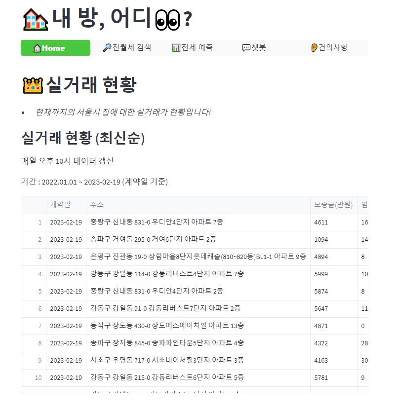

# 내 방 어디? v1(~2023.02.01)
[내 방 어디? 링크](https://seungkyu37-project2-app-3b4qng.streamlit.app/)

## 목적
계약일 기준 2022년 1월 1일부터 2023년 1월 30일까지의 **서울시 전/월세 실거래 데이터 기반 검색** 및 **전세 시세 예측** 웹 개발

## 주요 기능
- 홈페이지
    - 실거래 현황(최신순)
    - 월세 실거래 수 지역 순위(top10)
    - 전세 실거래 수 지역 순위(top10)
- 전월세 검색페이지
    - 해당구, 해당동, 전/월세 구분 검색
    - 보증금, 월세, 임대면적 슬라이더 검색
- 전세 예측페이지
- 건의사항페이지
    - 게시판 작성자, 이메일, 제목, 내용 저장을 위한 db 구축
    - 문의 내용 작성칸 구축
    - 게시판 목록 구현

## 설치 방법
### Windows
+ 버전 확인 
    - python : 3.9.13
    - vscode : 1.74.1
    - 라이브러리 :  pandas (1.5.3), numpy (1.24.1), plotly (5.13.0), matplotlib (3.6.3), streamlit (1.17.0), streamlit-option-menu (0.3.2)

+ 주요 라이브러리 설치
    - `pip install numpy, pandas, plotly, matplotlib, streamlit, streamlit-option-menu`

# 내방 어디? v2(2023.02.02~)

## 주요 기능 업데이트 내용
- 홈페이지
    
- 전월세 검색페이지
    - 전/월세 구분 검색 중 모두 검색할 수 있도록 추가
    - 보증금, 월세, 임대면적 최소/최대값 정해줄 수 있도록 추가

- 전세 예측페이지

- 건의사항페이지